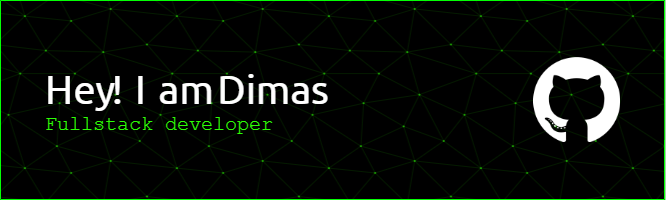

## Hi There 👋, I'm Dimas 👨‍💻

- 🌱 I’m currently learning **Laravel**
- 😄 Pronouns: 👍👍👍
- ⚡ Fun fact: ✌️✌️✌️
   

##### 💻 Skill

 

<!--

-->

##### 🌐 Connect with me

 
 

##### 📊 My Github Stats

[] 
 

